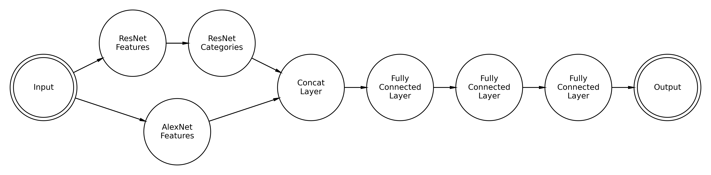
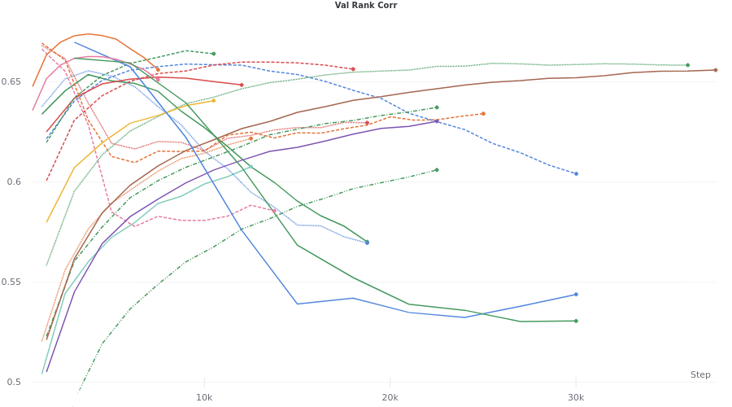

# ResMem

This is a package that wraps [ResMem](https://coen.needell.co/project/memnet/). This is a residual neural network that 
estimates the memorability of an image, on a scale of 0 to 1.

## How to Use
To install from PyPI:
```shell
pip install resmem
```

The package contains two objects, ResMem itself, and a preprocessing transformer function built on torchvision.
```python
from resmem import ResMem, transformer

model = ResMem(pretrained=True)

```
The `transformer` is designed to be used with pillow.

```python
from PIL import Image

img = Image.open('./path/to/image') # This loads your image into memory
img = img.convert('RGB') 
# This will convert your image into RGB, for instance if it's a PNG (RGBA) or if it's black and white.

model.eval()
# Set the model to inference mode.

image_x = transformer(img)
# Run the preprocessing function

prediction = model(image_x.view(-1, 3, 227, 227))
# For a single image, the image must be reshaped into a batch
# with size 1.
# Get your prediction!

print(prediction)
# see result
```

For more advanced usage, see the `sample.py` file in this repository.

## Description of the Model

Historically, the next big advancement in using neural networks after AlexNet, the basis for MemNet, was ResNet. This allowed for convolutional neural networks to be built deeper, with more layers, without the gradient exploding or vanishing. Knowing that, let's try to include this in our model. What we will do is take a pre-trained ResNet, that is the whole thing, not just the convolutional features, and add it as an input feature for our regression step. The code for this is [here.](https://www.coeneedell.com/appendix/memnet_extras/#resmem)



For the following discussion, while ResMem is initialized to a pre-trained optimum, I have allowed it to retrain for our problem. The thought is that given a larger set of parameters the final model *should* be more generalizable. Using weights and biases, we can run a hyperparameter sweep.



Here we can see much higher peaks, reaching into the range of 0.66-0.67! All of these runs were both trained and validated on a dataset that was constructed from both MemCat and LaMem databases.

## Github Instructions

If you want to fiddle around with the raw github sourcecode, go right ahead. But be aware that we use git lfs for the 
model storage. You'll have to install the package at https://git-lfs.github.com/ and then run:
```shell
git lfs install
git lfs pull
```
to get access to the full model. Also note that the `tests.py` file that's included with this repository references a 
database that we, at this time, do not have permission to distribute, so consider that test file to be a guide rather 
than a hard-and-fast test.

## Citation

```
@inproceedings{ResMem2021,
title = {Embracing New Techniques in Deep Learning for Predicting Image Memorability},
author = {Needell, Coen D. and Bainbridge, Wilma A.},
booktitle = {Proceedings of the Vision Sciences Society, 2021},
year = {2021},
publisher = {ARVO Journals},
url = {https://www.coeneedell.com/publication/vss2021/vss2021.pdf}
}
```
